### 需求

- 富文本/md 文件的增删改查
- 富文本/md 文件的群组管理

### 调研

- pingcode https://pingcode.com/

  - 基本功能

    - 创建、编辑、删除、移动
    - 演示模式
    - 共享 （vip）
    - 导出为 PDF
    - 页面附件
    - 评论

  - 首页
    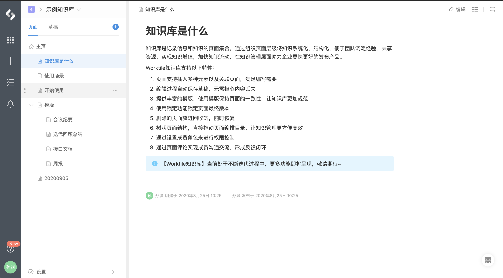
  - 编辑
    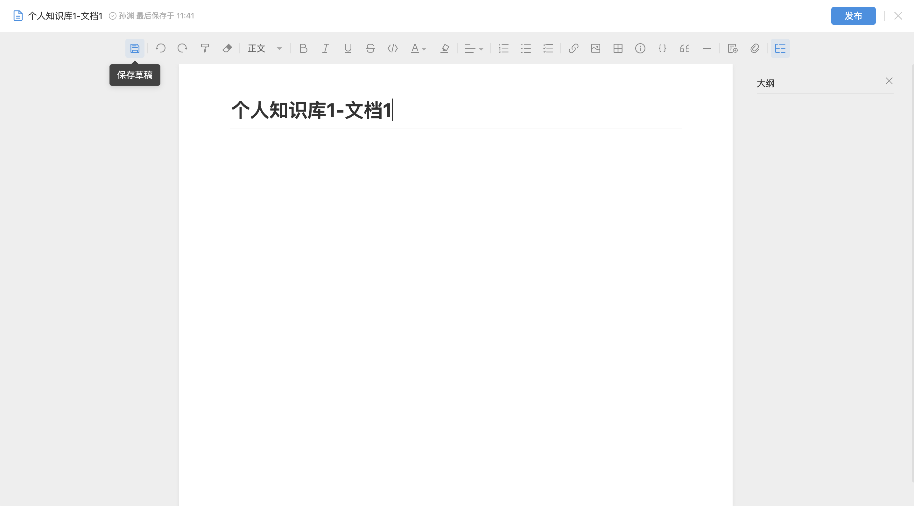

  - 特点
    1. 评论栏在左侧，区别于一般文档系统的在下侧
       - 功能上看，这有个好处，用户在浏览他人文件时，不用拖动到最底部，就可以发表评论。若是在底侧，用户看到文章中部，想发表评论，然后拖到页尾评论，完了想继续浏览，但找不到以前锚点。
       - UI 上看, 显的过于拥挤，页面有变形，体验不是特别好
    2. 页面间的切换操作简单，没有多余的弹窗和确认按钮。
  - 缺点:
    1. 组织结构:知识库 -> 文件, 不支持文件夹, 文件多了会混乱
    2. UI 很臃肿，有点偏 win10 的设计风格，线条过于僵硬，整体给人一种封闭式的感觉，稍显压抑。
    3. 只支持富文本模式，不支持脑图，md 等其他文本样式。
    4. 关键字搜索功能入口存在，但功能缺失，目测是有 bug，不能判断是否有更进一步的分词搜索。

- teambition https://thoughts.teambition.com/

  - 基本功能

    - 创建、编辑、删除、移动
    - 演示模式
    - 共享（vip）
    - 导出为 PDF、MD、WORD、HTML
    - ~~页面附件~~
    - ~~评论~~
    - 查看历史记录，有点类似 git
    - 添加协作者

  - 首页
    

  - 浏览
    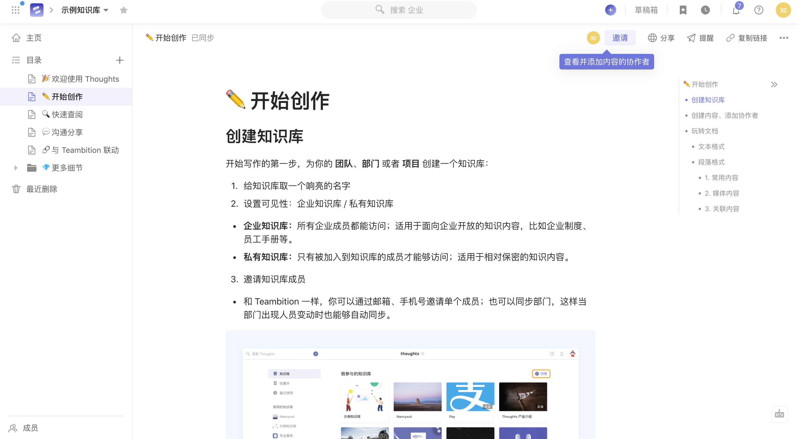

  - 编辑
    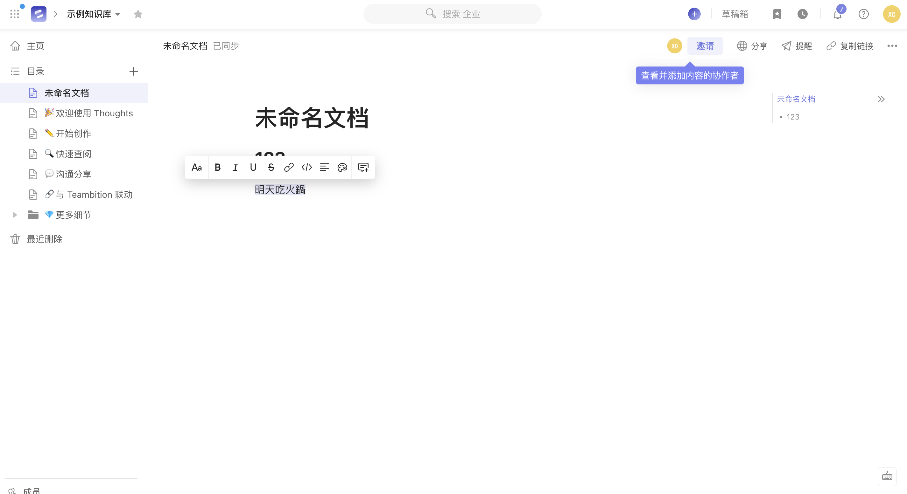

  - 特点
    1. 可以查看历史版本记录
    2. 可以添加协作者
    3. 可以导出的类型很多
    4. 支持关键字搜索和分词搜索
    5. 编辑的时候，各种样式按钮跟着鼠标走，这个比固定在文章顶部看着舒服
  - 缺点:
    1. 没有评论
    2. 没有 pingcode 那种附件，感觉附件有些多余

- 禅道 https://pro.demo.zentao.net/

  - 基本功能

    - 创建、编辑、删除、移动
    - 变更记录，但是没有变更记录的内容，可以添加变更备注

  - 首页
    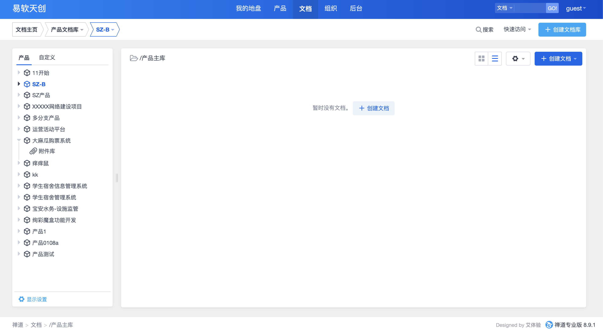

  - 浏览
    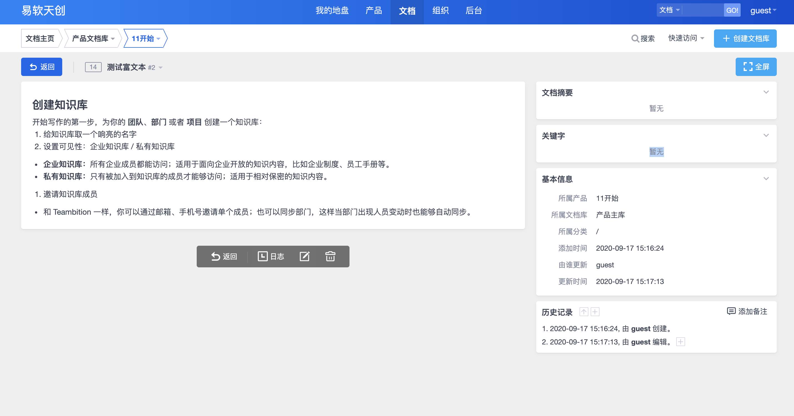

  - 编辑
    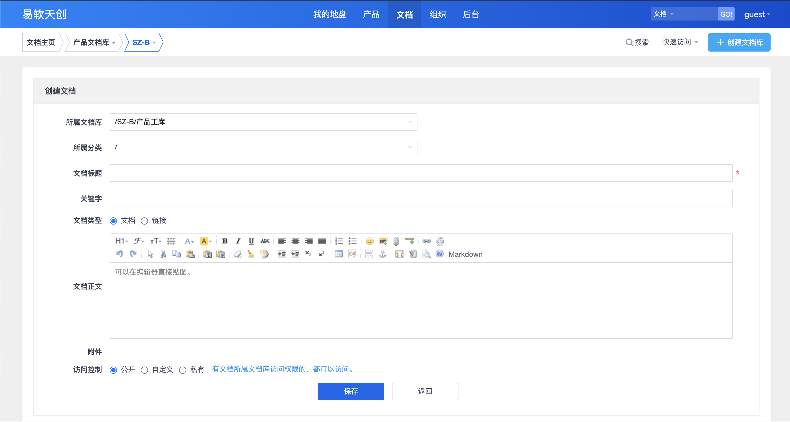

  - 特点
    1. 可以对每次的变更作出注释
  - 缺点
    1. 没有目录
    2. 默认打开无关信息和页面主体挤在一起, 体验不好，但是可以收起
    3. 无评论，无导航
    4. 无搜索

- tower https://tower.im/

  - 基本功能

    - 创建、编辑、删除、移动

  - 首页
    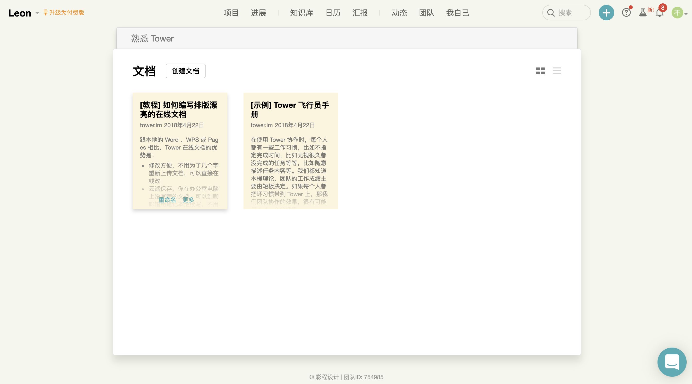

  - 浏览
    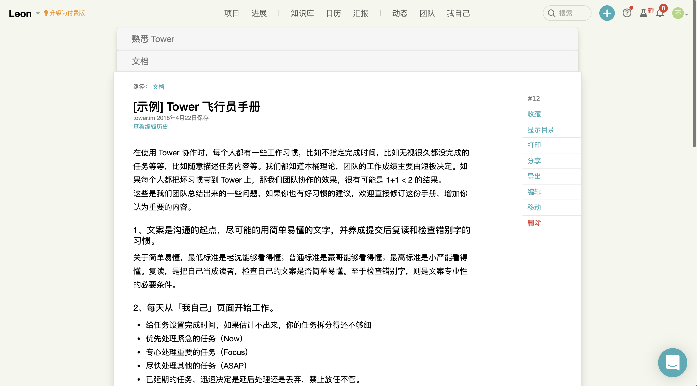

  - 编辑
    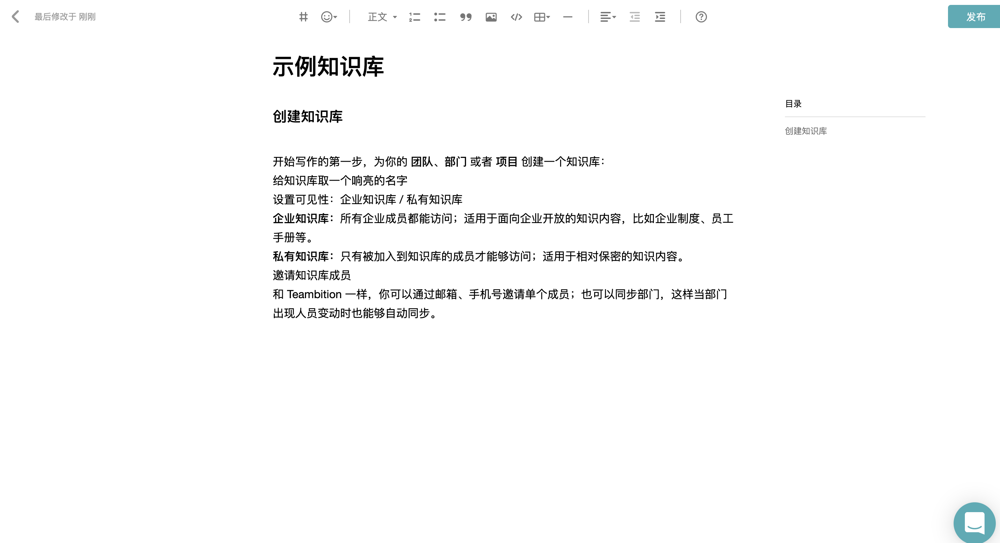

  - 特点
    1. 中规中矩，UI 上打磨的很 ok
  - 缺点
    1. 不是一个独立的文档服务，入口只能是某个项目

- confluence https://sfltmya.atlassian.net/wiki/spaces

  - 基本功能

    - 创建、编辑、删除、移动

  - 首页
    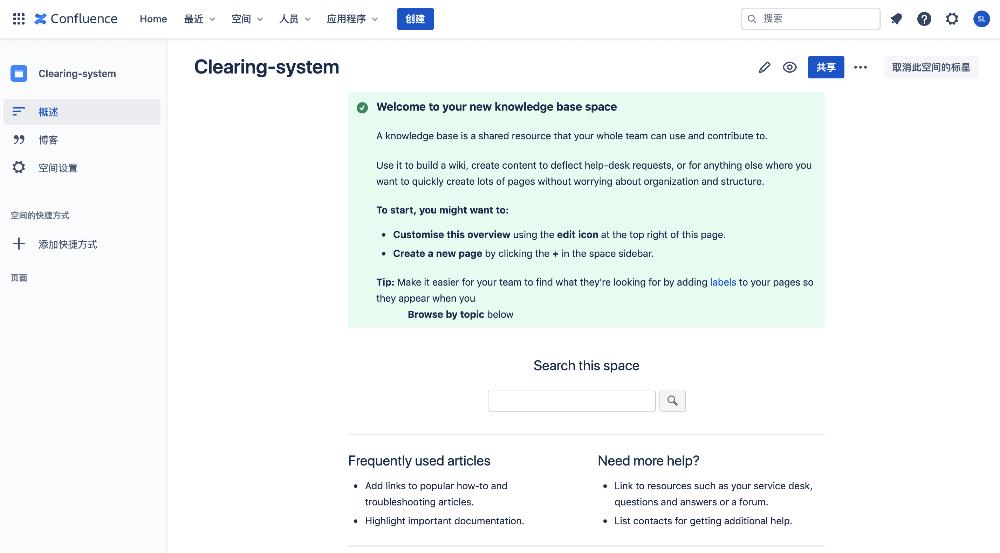

  - 浏览
    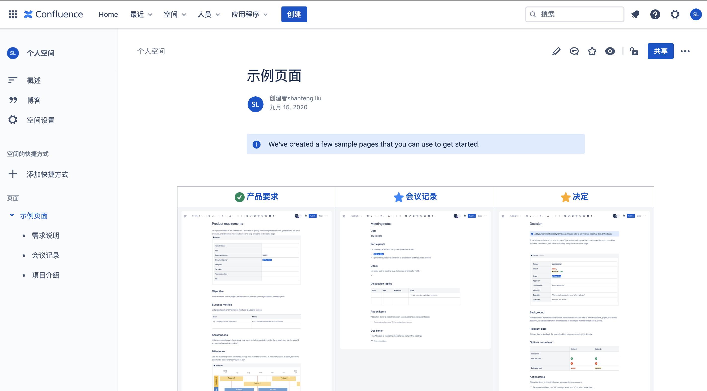

  - 编辑
    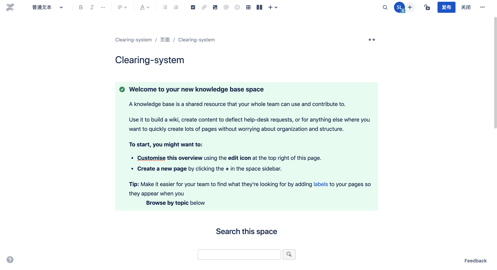

  - 特点
    1. UI 符合老外的标准审美，简单毫无花哨
    2. 支持 word 导入
    3. 支持评论的状态，有点像 github 的 comments
    4. 支持 slack、jira、bitbucket 等工具的集成
    5. 支持在线协作
  - 缺点
    1. 功能上没有明显的短板
    2. 没有 header 导航

- 语雀 https://www.yuque.com/

  - 基本功能

    - 创建、编辑、删除、移动

  - 首页
    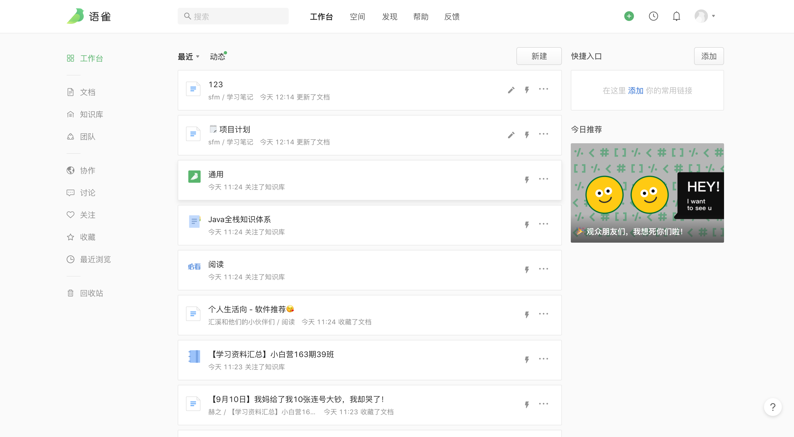

  - 浏览
    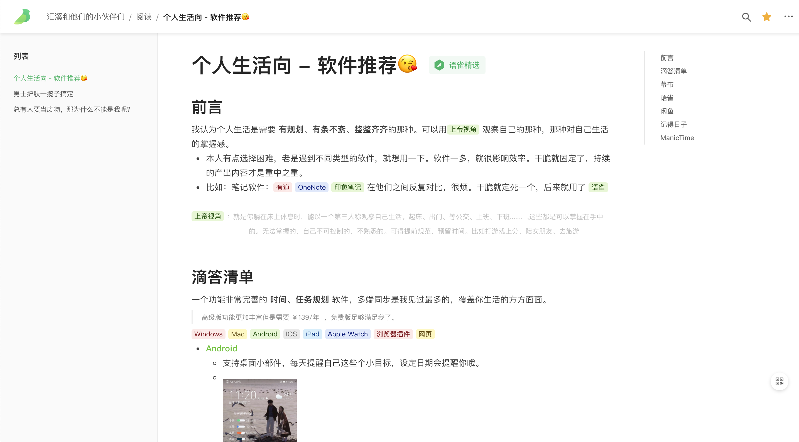

  - 编辑
    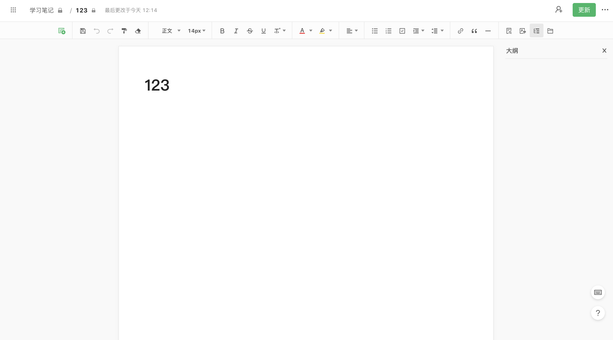

  - 特点
    1. 模拟成书的组织方式，目录+文章
    2. 有博客的味道
  - 缺点
    1. 功能上没有明显的短板
    2. ui 一些细小部分没有做好，画蛇添足

### 小结

- 整体风格比较欣赏语雀和 confluence, 简洁，
- write 界面偏向于 tower，样式按钮偏向于 teambition 的悬浮示
- 组织方式偏向于 confluence
  - wiki 会作为一个整体的服务，但也可以加上 tower 的那种搞法，部分文档和项目耦合，项目入口可以打开，wiki 入口也可以打开
  - 结合语雀订阅的特色，作为博客公布出去
